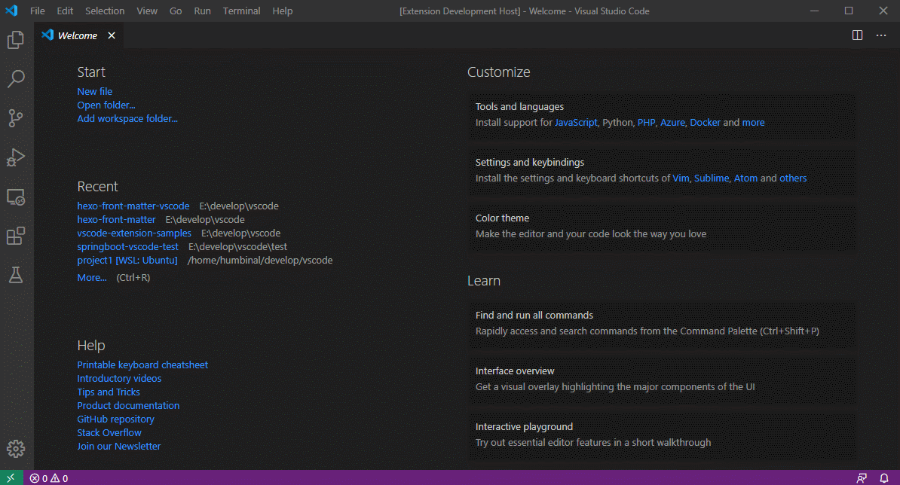

# hexo-front-matter-vscode
Hexo front matter plugin for Visual Studio Code.

## usage 1 
press 'ctrl+shift+p' and input "hexo front matter" in editor mode.

## usage 2
press 'ctrl+shif+alt+h' in editor mode.
